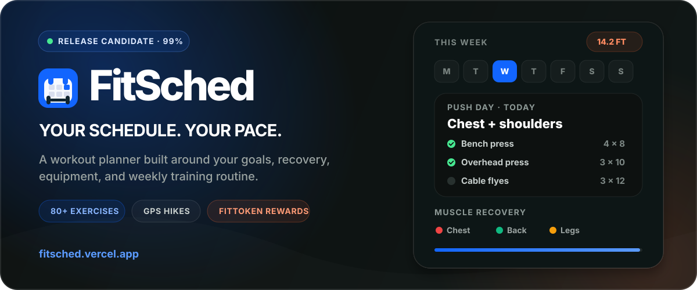

<div align="center">

  

  <br />

  <a href="https://fitsched.vercel.app/"><strong>Open FitSched</strong></a>
  &nbsp;&middot;&nbsp;
  <a href="#what-fitsched-does">Explore the features</a>
  &nbsp;&middot;&nbsp;
  <a href="#run-locally">Run locally</a>

  <br /><br />

  
  
  
  
  
  

</div>

## Fitness that fits real life

FitSched builds a weekly workout plan around a person's goals, experience, available equipment, injuries, target muscles, and training frequency. It brings that plan together with guided sessions, progress tracking, a daily schedule, GPS hikes, and FitToken rewards.

Plans come from a built-in exercise library and transparent recommendation rules, keeping every routine consistent with the user's profile and recent training history.

> FitSched is free to try at [fitsched.vercel.app](https://fitsched.vercel.app/).

## What FitSched does

| Area | Experience |
| --- | --- |
| Smart scheduling | Builds a seven-day routine from fitness goals, experience, equipment, injuries, target muscles, training frequency, and recent training history. Read-only Google Calendar events appear alongside the plan. |
| Guided workouts | Tracks exercises, sets, reps, rest periods, completion, motion verification, and optional on-device camera rep counting in beta. |
| Progress | Shows streaks, achievements, activity heatmaps, muscle recovery, workout history, and weekly recaps. |
| Outdoor activity | Records GPS hikes, route distance, elevation, and offline sessions that sync when the connection returns. |
| FitToken rewards | Awards in-app FitTokens for verified workouts and hikes, with optional Base network claiming when the contract is deployed. |
| Installable experience | Works as a responsive web app, installable PWA, and Capacitor-powered Android shell with push reminders. |

### Schedule. Train. Progress.

1. **Schedule** — complete onboarding and choose a goal, training setup, target muscles, experience level, and weekly frequency.
2. **Train** — follow the guided session while FitSched tracks sets, rest, movement verification, and recovery.
3. **Progress** — build streaks, unlock achievements, review trends, log hikes, and earn FitTokens for completed work.

## Current status

**99% complete — release candidate.** The core web app is working; final launch checks and store preparation remain.

Before the full public launch:

- purchase and connect a custom domain
- fund and finalize the FitToken launch
- complete Google Play developer registration
- perform the final production security audit

## Technology

| Layer | Technology |
| --- | --- |
| Application | Next.js 16 App Router, React 19, TypeScript 5 |
| Interface | Tailwind CSS 4, Framer Motion, Recharts, Lucide |
| Data | PostgreSQL, Prisma 6, Zustand |
| Accounts | Auth.js with credentials and Google sign-in |
| Integrations | Read-only Google Calendar import, Resend, Web Push, and optional Upstash-backed rate limiting |
| Mobile | Progressive Web App and Capacitor 8 for Android |
| Rewards | FitToken ledger, Viem, Solidity, Foundry, Base network integration |
| Hosting | Vercel with scheduled reminder and weekly-summary jobs |

## Run locally

### Requirements

- Node.js 20.9 or newer
- npm
- PostgreSQL
- the service credentials for any optional integration you want to test

### Setup

```bash
git clone https://github.com/Cocokylez/FitSched.git
cd FitSched
npm install
cp .env.example .env
npx prisma generate
npm run db:migrate
npm run dev
```

Open [http://localhost:3000](http://localhost:3000).

The starter environment template is in [`.env.example`](./.env.example). At minimum, local account flows need a PostgreSQL `DATABASE_URL` and an authentication secret. Calendar import, email, push notifications, maps, and on-chain FitToken claiming each require their own service credentials. Production features may also need `RESEND_API_KEY`, Upstash credentials, `CRON_SECRET`, and `ADMIN_SECRET`.

Never commit real secrets. Keep them in the ignored `.env` file locally and in the deployment provider's protected environment settings for production.

## Useful commands

| Command | Purpose |
| --- | --- |
| `npm run dev` | Start the development server |
| `npm run build` | Generate the Prisma client and create a production build |
| `npm run start` | Run the production server |
| `npm run lint` | Check the codebase with ESLint |
| `npm run db:migrate` | Create and apply a local Prisma migration |
| `npm run db:studio` | Open Prisma Studio |
| `npm run cap:open:android` | Open the Android project |

## Project map

```text
src/app/                 pages, layouts, server actions, and API routes
src/components/          product interface and reusable components
src/context/             language and theme providers
src/lib/                 scheduling, rewards, security, tracking, and integrations
prisma/                  PostgreSQL schema
public/                  app icons, manifest, service worker, and exercise assets
android/                 Capacitor Android project
fittoken/                Solidity contract, tests, and deployment scripts
docs/                    security and project notes
```

## Security and privacy

FitSched handles account, workout, calendar, and optional location data. The project supports encryption of stored OAuth tokens when `FIELD_ENCRYPTION_KEY` is configured, alongside request limiting, input validation, password and email verification, anti-cheat checks, and user-facing privacy and terms pages. See the [security hardening notes](./docs/security-hardening.md) for the current baseline.

Before a production launch, deployment secrets and OAuth configuration should be reviewed, the database should be backed up, and the final security audit should be completed.

## Author

Built by **Adrian Kyle Condeza**.

[Portfolio](https://kylesportfolio.vercel.app/) &nbsp;&middot;&nbsp; [GitHub](https://github.com/Cocokylez) &nbsp;&middot;&nbsp; [Email](mailto:kuyag100621@gmail.com)
